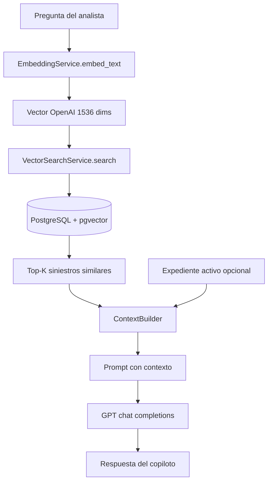

# Embeddings y pgvector en fraude-back

Este documento explica **cómo usamos vectores semánticos** para el copiloto antifraude: qué se indexa, dónde se guarda en PostgreSQL y cómo entra en el flujo RAG del chat.

---

## Resumen en una frase

Cada **siniestro** se convierte en un vector numérico de 1536 dimensiones con OpenAI; ese vector vive en PostgreSQL gracias a **pgvector**. Cuando el analista pregunta algo en el chat, convertimos la pregunta al mismo espacio vectorial y buscamos los siniestros **más parecidos semánticamente** para dárselos como contexto a GPT.

---

## ¿Para qué lo usamos?

| Uso | Descripción |
|-----|-------------|
| **Consulta global** (`/copiloto`) | Preguntas sobre toda la cartera: talleres con alertas, sucursales, patrones, etc. |
| **Auditoría de un caso** (`CopilotChat` en `/caso/[id]`) | El expediente activo va fijo en el contexto; pgvector aporta siniestros **relacionados** como referencia comparativa. |

**No usamos pgvector para calcular el score de fraude.** El score (RF-01, RF-06, etc.) viene de `FraudScoringService` y se guarda en `scoring_payload`. Los embeddings solo ayudan a **recuperar** siniestros relevantes para responder en lenguaje natural.

---

## Arquitectura del flujo RAG



Pasos concretos en `ChatService.answer()`:

1. **Embed de la pregunta** → vector de la consulta.
2. **Búsqueda vectorial** → los `k` siniestros más cercanos (cosine distance).
3. **ContextBuilder** → texto estructurado con montos, score, reglas, relato, etc.
4. **GPT** → responde usando solo ese contexto + historial de la sesión.

---

## Capa de base de datos: pgvector

### Extensión y columna

Migración: `alembic/versions/20260528_0005_add_siniestros_embeddings.py`

```sql
CREATE EXTENSION IF NOT EXISTS vector;

ALTER TABLE siniestros ADD COLUMN embedding vector(1536);

CREATE INDEX ix_siniestros_embedding
  ON siniestros USING hnsw (embedding vector_cosine_ops);
```

| Elemento | Valor |
|----------|--------|
| Tabla | `siniestros` |
| Columna | `embedding vector(1536)` |
| Modelo OpenAI | `text-embedding-3-small` → 1536 dimensiones |
| Índice | **HNSW** con operador **cosine** (`vector_cosine_ops`) |
| ORM | `pgvector.sqlalchemy.Vector` en `app/models/siniestro.py` |

### ¿Por qué HNSW y cosine?

- **Cosine distance** (`<=>` en SQL) mide similitud semántica entre textos embebidos, no importa la magnitud del vector sino el ángulo.
- **HNSW** acelera búsquedas aproximadas cuando hay muchos siniestros; es el índice recomendado para pgvector en producción.

En SQLAlchemy/pgvector la consulta se traduce a algo equivalente a:

```sql
SELECT *, embedding <=> :query_vector AS distance
FROM siniestros
WHERE embedding IS NOT NULL
ORDER BY distance ASC
LIMIT :k;
```

En código (`app/integrations/chat/vector_search.py`):

```python
distance_expr = Siniestro.embedding.cosine_distance(query_vector)
# ...
similarity = max(0.0, 1.0 - float(distance))
```

---

## Capa de embeddings: OpenAI

Archivo: `app/integrations/chat/embedding_service.py`

### Configuración (`.env`)

```env
OPENAI_API_KEY=sk-...
EMBEDDING_MODEL=text-embedding-3-small
CHAT_K_RESULTS=8
```

### Dos modos de uso

| Método | Entrada | Cuándo |
|--------|---------|--------|
| `embed_text(text)` | Cualquier string | Pregunta del usuario en el chat |
| `embed_siniestro(siniestro)` | Objeto `Siniestro` | Indexación al crear/ingestar siniestros |

### Texto que se embebe por siniestro

Se concatena un resumen legible con los campos más útiles para búsqueda semántica:

- ID, ramo, cobertura, descripción
- Asegurado, póliza, beneficiario, estado
- Montos y días de vigencia / reporte
- Si la documentación está completa

Ejemplo simplificado:

```
Siniestro SIN-2024-047. Ramo: Vehículos. Cobertura: Robo total.
Descripcion: ... Asegurado: AS-042. Beneficiario: Juan Pérez. ...
```

**Importante:** el embedding refleja el contenido del siniestro en el momento de indexar. Si cambia la descripción o se recalcula el score, el vector **no se actualiza solo**; hay que re-indexar (ver más abajo).

---

## Indexación: cuándo se generan los vectores

Archivo: `app/integrations/chat/index_service.py`

### Automática

| Evento | Dónde |
|--------|-------|
| Crear siniestro manual (`POST /siniestros`) | `app/api/v1/endpoints/siniestros.py` → `index_one()` |
| Ingesta desde Gmail/PDF | `app/integrations/gmail/service.py` → `index_one()` tras commit |

### Manual / batch

| Endpoint | Acción |
|----------|--------|
| `GET /api/v1/chat/index/status` | Total, indexados y pendientes (filtrado por analista si aplica) |
| `POST /api/v1/chat/index` | Indexa hasta 1000 siniestros con `embedding IS NULL` |

### Comportamiento de `index_pending()`

- Solo procesa filas **sin** embedding.
- Llama a OpenAI por cada siniestro pendiente.
- Hace `commit` al final si indexó al menos uno.
- Errores por siniestro se registran y cuentan como `skipped` sin detener el lote.

---

## Búsqueda vectorial en el chat

Archivo: `app/integrations/chat/vector_search.py`

### Filtros aplicados

1. `embedding IS NOT NULL` — siniestros no indexados no aparecen en RAG.
2. **`owner_email`** — cada analista solo recupera sus siniestros (multi-tenant).

### Parámetro `k`

- Consulta global: por defecto `k=8` (`CHAT_K_RESULTS`).
- Caso específico (`id_siniestro` en el body): `k` se limita a **4** para dejar margen al expediente activo, que se inyecta aparte.

### Modo caso vs global

En auditoría de un expediente (`ChatService`):

1. Se carga el **expediente activo** por `id_siniestro` (no depende del vector search).
2. La búsqueda vectorial trae siniestros **relacionados**.
3. Se excluye el activo de los hits para no duplicarlo.
4. El prompt de sistema (`CASE_SYSTEM_PROMPT`) obliga a responder primero sobre el expediente en auditoría.

En consulta global no hay expediente fijo: todo el contexto viene de los top‑K recuperados por similitud.

---

## Del vector al texto que ve GPT

Archivo: `app/integrations/chat/context_builder.py`

Para cada siniestro (activo o recuperado) se arma un bloque con:

- Datos del expediente (beneficiario, póliza, montos, fechas)
- **Score oficial** recalculado con `official_score_for_siniestro()` (alineado con la Clarity Card)
- Reglas activas y relato
- Resumen de auditoría IA si existe en `scoring_payload`

Ese texto **no es el embedding**; es la capa legible que GPT usa para razonar. pgvector solo decide **qué siniestros** incluir.

---

## API y frontend

### Backend

```
POST /api/v1/chat/query
{
  "question": "¿Qué taller concentra alertas rojas?",
  "session_id": "global",
  "k": 8,
  "id_siniestro": null          // null = global; "SIN-..." = modo caso
}
```

Respuesta incluye `sources[]` con los siniestros usados y su `similarity`.

### Frontend

- `src/services/claims.ts` → `sendMessageToAgent()` llama a `/chat/query`.
- `src/hooks/useChatQuery.ts` → sesiones `global` o `caso-{claimId}`.
- Historial persistido en tablas `chat_sessions` / `chat_messages` (no en pgvector).

---

## Multi-tenant (analista)

Los siniestros tienen `owner_email`. Tanto la indexación como la búsqueda respetan ese filtro cuando el request lleva el header del analista autenticado. Un analista **no** recupera embeddings de siniestros de otro usuario en el vector search.

---

## Limitaciones y buenas prácticas

### Siniestros sin embedding

Si `embedding IS NULL`, el siniestro **no participa** en búsquedas RAG. El chat sigue funcionando pero con menos contexto. Revisar:

```bash
GET /api/v1/chat/index/status
POST /api/v1/chat/index
```

### Embeddings desactualizados

Cambios en descripción, montos o datos clave **no** regeneran el vector automáticamente. Tras editar un siniestro conviene:

- Volver a indexar (hoy solo hay batch de pendientes; para re-indexar habría que poner `embedding = NULL` o añadir un endpoint de re-index por ID).

### Coste y latencia

- `text-embedding-3-small`: bajo coste (~$0.02 / 1M tokens).
- Cada pregunta del chat = **1 llamada** a embeddings + **1** a GPT.
- Indexar N siniestros = N llamadas a embeddings (en ingesta o en `/chat/index`).

### pgvector vs score de fraude

| Sistema | Tecnología | Propósito |
|---------|------------|-----------|
| Score / reglas RF-xx | Reglas + señales IA en `scoring_payload` | Riesgo cuantificado y auditable |
| Embeddings + pgvector | OpenAI + cosine search | Recuperar casos parecidos para el copiloto |

Son complementarios, no intercambiables.

---

## Mapa de archivos

```
fraude-back/
├── alembic/versions/20260528_0005_add_siniestros_embeddings.py
├── app/
│   ├── models/siniestro.py              # columna embedding Vector(1536)
│   ├── core/config.py                   # EMBEDDING_MODEL, CHAT_K_RESULTS
│   ├── integrations/chat/
│   │   ├── embedding_service.py         # OpenAI embeddings
│   │   ├── index_service.py             # index_one / index_pending
│   │   ├── vector_search.py             # pgvector cosine search
│   │   ├── context_builder.py           # texto para GPT
│   │   └── chat_service.py              # orquestación RAG
│   ├── api/v1/endpoints/chat.py         # /query, /index, /index/status
│   └── integrations/gmail/service.py    # index al crear desde correo
└── requirements.txt                     # pgvector>=0.3.0
```

---

## Cómo probarlo localmente

1. Tener PostgreSQL con extensión `vector` (la migración la crea).
2. Configurar `OPENAI_API_KEY` en `.env`.
3. Levantar backend y aplicar migraciones: `.\scripts\dev-up.ps1`
4. Verificar indexación:

   ```http
   GET  http://127.0.0.1:8000/api/v1/chat/index/status
   POST http://127.0.0.1:8000/api/v1/chat/index
   ```

5. Probar una consulta:

   ```http
   POST http://127.0.0.1:8000/api/v1/chat/query
   Content-Type: application/json
   X-Analyst-Email: tu@email.com

   {
     "question": "¿Cuáles casos tienen demora en denuncia de robo?",
     "session_id": "global",
     "k": 8
   }
   ```

6. En el frontend: `/copiloto` (global) o abrir un caso y usar el panel **Auditoría Agéntica**.

---

## Referencia adicional

Plan de diseño original (más detalle histórico): [`docs/PLAN_CHAT_RAG.md`](./PLAN_CHAT_RAG.md)
